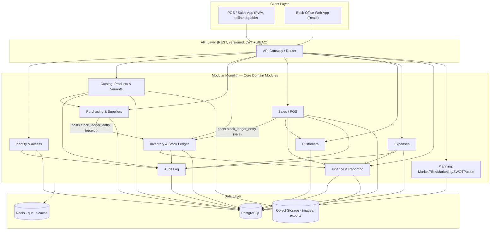
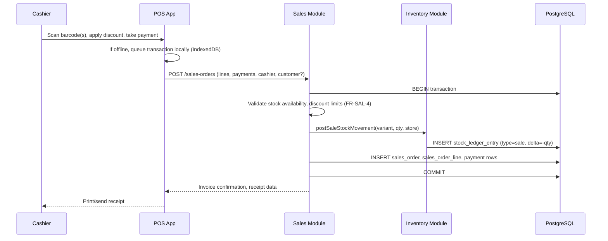
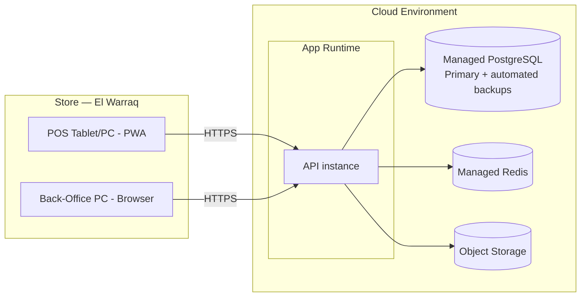

# STRIDE ERP — System Architecture

Companion to `SRS.md` and `Database.md`. Defines how the system is built, deployed, and operated to satisfy the functional and non-functional requirements — in particular NFR-1/2 (data integrity/auditability), NFR-4 (POS performance), NFR-5 (multi-store scalability), NFR-8 (offline POS resilience), and NFR-9 (backup/recovery), given that this business is currently one Excel file with zero infrastructure.

---

## 1. Architecture style decision

**Decision: Modular Monolith, deployed as a single backend service with clearly separated internal modules, backed by PostgreSQL.**

| Option | Verdict | Why |
|---|---|---|
| Microservices | Rejected for v1 | A single store with a handful of concurrent users does not need independently scaled services; microservices would add deployment/ops complexity (service discovery, distributed transactions across Sales↔Inventory↔Finance, network latency) without a corresponding benefit. The workbook's core failure was *disconnected* data (Sales Tracker vs. Inventory Tracker) — splitting those into separate services on day one would risk reintroducing the same disconnect via eventual consistency bugs. |
| Modular Monolith | **Chosen** | One deployable unit, one database, but code is organized into bounded modules (Catalog, Purchasing, Inventory, Sales, Expenses, Finance/Reporting, Planning, Identity) with enforced internal boundaries (no module reaches into another's tables directly — only through its service interface). This gives a clean extraction path to microservices later (per NFR-5's multi-store growth path) without paying distributed-systems tax now. |
| Serverless functions | Rejected for v1 | POS and inventory operations are transactional and latency-sensitive (NFR-4); cold starts and split-function transactions are a poor fit for "scan → decrement stock → charge → print receipt" as one atomic unit. |

Module boundaries map directly to the SRS sections (§3.1–3.12) and the Database.md table groupings, so the same seams that separate the docs also separate the code.

---

## 2. Technology stack

| Layer | Choice | Rationale |
|---|---|---|
| Database | **PostgreSQL** | Strong transactional guarantees (critical for the stock ledger), mature JSON support for flexible fields (audit before/after, permissions), generated/computed columns for the "mirror the Excel formula as a column" pattern used throughout Database.md, excellent Windows/Linux/cloud support. |
| Backend | **Node.js + TypeScript** (NestJS or Express w/ layered structure) | Type safety end-to-end when paired with a TS frontend; strong ecosystem for REST APIs, background jobs, and Postgres drivers/ORMs (Prisma or TypeORM); easy to hire for. Equally valid alternative: a statically typed backend (e.g. Go or Java/Kotlin) if the team's existing skillset favors it — the module boundaries and data model are language-agnostic. |
| API style | **REST (JSON) over HTTPS**, versioned (`/api/v1/...`) | Simple, cache-friendly, easy for a POS frontend and mobile clients to consume; GraphQL is not justified at this scale/team size. |
| Frontend (back-office + POS) | **React + TypeScript**, component library for data-dense tables/dashboards | Matches the dashboard-heavy nature of the source workbook (KPI Dashboard, Product Dashboard); React's ecosystem covers offline-capable PWA patterns needed for NFR-8. |
| POS client | **Progressive Web App** (installable, works on tablets/low-cost hardware), with a local **IndexedDB** queue for offline sales | Avoids requiring dedicated POS hardware/OS; satisfies NFR-8 without a native app build pipeline. |
| Auth | **JWT-based session auth**, short-lived access token + refresh token, RBAC enforced server-side per request | Standard, stateless, works well across POS/back-office/mobile. |
| Background jobs | **Queue-backed worker** (e.g., BullMQ on Redis, or Postgres-based job table if avoiding a new dependency) | Powers reorder-alert generation (FR-INV-8), scheduled report snapshots, offline-sync reconciliation. |
| File/image storage | **Object storage** (S3-compatible) | Product images, exported PDFs/CSVs (FR-KPI-4). |
| Hosting | **Single cloud provider**, managed Postgres + container hosting (e.g., a managed Postgres instance + a container/app-service runtime) | Avoids self-managed database operations for a small team; consistent with "production-ready" without over-engineering for a one-store business. |

These are recommendations, not irreversible commitments — the module boundaries in §3 and the schema in `Database.md` do not depend on any specific framework.

---

## 3. Module (bounded context) map

**Rule enforced across the codebase**: only the `Inventory` module writes to `stock_ledger_entry`. `Sales` and `Purchasing` call Inventory's service interface (e.g. `postSaleStockMovement()`, `postReceiptStockMovement()`) rather than writing rows directly. This is the architectural guardrail that permanently fixes the workbook's Sales-Tracker/Inventory-Tracker disconnect (FR-INV-2) — it is structurally impossible for a sale to complete without a corresponding stock movement, because they are the same transaction.

---

## 4. Key data flows

### 4.1 A sale at POS (closes the workbook's biggest gap)

Both the invoice and the stock decrement commit in the **same database transaction** — atomicity is enforced at the data layer, not by hoping two spreadsheet tabs stay in sync.

### 4.2 Goods receipt (the receiving step the workbook never had)

`Purchase Order (approved)` → warehouse staff scans/enters received quantities → `Goods Receipt` created → Inventory module posts `stock_ledger_entry` (type=receipt, +qty) per line → PO status updates to `partially_received`/`received` → any discrepancy is recorded against the PO line for supplier follow-up (FR-PUR-3).

### 4.3 Reporting (plan vs. actual)

`Finance & Reporting` module never stores computed figures as facts. It exposes read models (views described in `Database.md` §7.2) that compute Break-Even/Cash Flow/P&L either from **forecast scenario** inputs (plan mode, matching the original workbook behavior) or from **actual Sales/Expense/Goods-Receipt transactions** (actual mode, which the workbook could never do because its trackers were disconnected). The KPI Dashboard queries these views on demand rather than relying on manually refreshed cells.

---

## 5. Offline POS design (NFR-8)

Retail-floor connectivity cannot be assumed reliable. The POS PWA:

1. Caches the current product/variant/price catalog locally (synced periodically).
2. On sale completion, writes the transaction to a local queue (IndexedDB) **and** attempts an immediate API call.
3. If the API call fails, the transaction stays queued with a client-generated idempotency key; a background sync retries when connectivity returns.
4. The server deduplicates on the idempotency key so a retried sync can never double-decrement stock or double-charge.
5. Stock availability checks during offline mode use the last-synced snapshot; a rare oversell-while-offline is resolved by the Inventory module as a negative-stock exception queue for manager review (better than blocking the sale entirely on the retail floor).

---

## 6. Security architecture (NFR-6)

- **AuthN**: username/password (bcrypt/argon2 hashed) + JWT access/refresh tokens; short-lived access tokens (e.g., 15 min) with silent refresh.
- **AuthZ**: RBAC enforced server-side on every endpoint via the `role`/`user_role` model in `Database.md` §2.2; sensitive fields (cost price, margin, cash position) are hidden from the `cashier` role's API responses by default, not just hidden in the UI.
- **Transport**: HTTPS everywhere, HSTS.
- **At rest**: database encryption at rest (managed Postgres default), object storage server-side encryption.
- **Secrets**: environment-based secrets management (never committed), rotated credentials for DB/storage.
- **Audit**: every mutation on price, stock, discount-approval, PO-approval, and expense-approval writes to `audit_log` (Database.md §9.1) via a service-layer interceptor — not optional, not bypassable from the API.

---

## 7. Integrations (present and anticipated)

| Integration | Purpose | Priority |
|---|---|---|
| Barcode scanner (USB/Bluetooth HID) | POS scan-to-sell, receiving | v1 — the workbook already budgets for a POS system in Startup Costs |
| Receipt printer | POS receipt printing (Startup Costs line item) | v1 |
| Payment terminal / card reader | In-store card payments | v1 or fast-follow, depending on the store's actual card acceptance plans |
| SMS/WhatsApp | Low-stock alerts to owner, customer notifications (future CRM) | Phase 2+ |
| Accounting export (CSV/PDF) | Hand-off to an accountant/bookkeeper (FR-KPI-4) | v1 |
| Security camera / loss-prevention system | Budgeted in Startup Costs but data integration explicitly out of scope for STRIDE v1 (operates as independent hardware) | Not planned |

---

## 8. Deployment view

- **Environments**: `dev`, `staging`, `production` — schema migrations run through a controlled pipeline (never hand-edited in production, the exact discipline missing from the Excel era).
- **Backups (NFR-9)**: automated daily Postgres backups with point-in-time recovery; defined RPO ≤ 24h / RTO ≤ 4h for v1, tightened as the business grows.
- **Multi-store readiness (NFR-5)**: `store_id` is a first-class column on every operational table from day one (see `Database.md`), so adding a second store is a data-onboarding exercise, not a re-architecture. The app runtime scales horizontally behind a load balancer if/when concurrent load requires it.

---

## 9. Observability

- **Structured logging** (JSON logs) from the API layer, correlated by request ID, shipped to a log aggregator.
- **Application metrics**: request latency/error rate per endpoint, queue depth for background jobs, offline-sync backlog size.
- **Business alerting**: low-stock/reorder alerts (FR-INV-8), negative-cash-projection warnings (FR-FIN-7) surfaced both in-app and via a notification channel (email at minimum for v1).
- **Audit trail** doubles as a forensic/observability tool for "who changed this price/stock/expense and when" (NFR-2).

---

## 10. Explicit non-goals for v1 architecture

- No multi-region/multi-cloud active-active setup — unnecessary for a single Egyptian retail business at this stage.
- No microservices split — deferred until module boundaries prove insufficient under real multi-store load (see `Roadmap.md`).
- No native mobile app — the PWA approach covers the offline POS requirement without a separate iOS/Android codebase.
