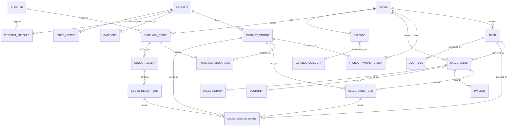

# STRIDE ERP — Database Design

Companion to `SRS.md`. This document defines the relational schema that satisfies the functional requirements, with particular attention to the workbook's biggest structural gap: **stock must be tracked per size/color variant via an append-only ledger, not as hand-edited quantity cells.**

Engine target: PostgreSQL (see `Architecture.md` for rationale). Conventions: `uuid` primary keys, `snake_case` names, `created_at`/`updated_at` timestamps on every table, soft-delete via `is_active`/`deleted_at` where records must never truly disappear (audit requirement NFR-2).

---

## 1. Entity Overview

---

## 2. Core Tables

### 2.1 `store`
*(from Business Info — FR-CFG-1/2)*

| Column | Type | Notes |
|---|---|---|
| id | uuid PK | |
| name | text | |
| address | text | |
| size_sqm | numeric | |
| frontage_m | numeric | |
| opening_date | date | |
| concept | text | |
| target_market | text | |
| currency | text | default `'EGP'` |
| vat_rate | numeric(5,2) | default `14.00` |
| is_active | boolean | |
| created_at / updated_at | timestamptz | |

### 2.2 `user`, `role`, `user_role`
*(FR-USR-1)*

- `user`: id, store_id (nullable = all-store access), full_name, email, phone, password_hash, is_active, created_at.
- `role`: id, name (`owner`, `manager`, `cashier`, `inventory_clerk`, `accountant`, `viewer`), permissions (jsonb or normalized `role_permission` table).
- `user_role`: user_id, role_id, store_id (role can be scoped per store for multi-branch staff).

### 2.3 `supplier`
*(from Suppliers — FR-SUP-1)*

| Column | Type | Notes |
|---|---|---|
| id | uuid PK | |
| name | text | |
| factory_name | text | |
| address | text | |
| phone | text | |
| whatsapp | text | |
| social_contact | text | |
| minimum_order | text | free text ("20 cartons") kept for flexibility; `minimum_order_cartons` numeric optional |
| payment_terms | text | |
| lead_time_days_min / max | int | parsed from "7-10 days" style input |
| quality_rating | smallint | 1–5, `CHECK` constraint |
| notes | text | |
| is_active | boolean | |

`supplier_ledger` (FR-SUP-3): id, supplier_id, po_id (nullable), type (`deposit`, `payment`, `credit_note`), amount, balance_after, note, created_at — running payables balance per supplier.

### 2.4 Category / lookup tables
*(FR-CAT-3, NFR-3 — controlled vocab replacing free text)*

- `category` (Casual, Sport, Formal, Sandal, Boot, School…)
- `gender` (Men, Women, Kids, Unisex)
- `product_type` (Sneaker, Sandal, Boot, Loafer…)
- `size_standard` + `size_value` (supports EU/UK/US size systems; a shoe "size range" expands into rows here)
- `color`
- `payment_method` (Cash, Card, Mobile Wallet, Bank Transfer, Split)
- `expense_category` (seeded from Monthly Expenses: Rent, Salaries, Electricity, Water, Internet, Cleaning, Packaging, Transportation, Maintenance, Taxes, Marketing, Unexpected, Other — extensible)

### 2.5 `product`
*(from Inventory Plan — FR-CAT-1)*

| Column | Type | Notes |
|---|---|---|
| id | uuid PK | |
| model_name | text | e.g. "Model AN-101" |
| category_id | FK | |
| gender_id | FK | |
| product_type_id | FK | |
| brand | text | |
| base_cost_price | numeric(10,2) | default/reference cost; actual cost tracked per PO line & variant stock lot |
| base_selling_price | numeric(10,2) | |
| description | text | |
| image_url | text | |
| is_active | boolean | |

### 2.6 `product_variant`
*(FR-CAT-2 — the critical structural fix over the workbook)*

| Column | Type | Notes |
|---|---|---|
| id | uuid PK | |
| product_id | FK → product | |
| size_value_id | FK → size_value | e.g. "42" |
| color_id | FK → color | |
| barcode | text | UNIQUE, auto-generated if not supplied (FR-CAT-4) |
| cost_price_override | numeric(10,2) | nullable — falls back to product/PO cost |
| selling_price_override | numeric(10,2) | nullable — falls back to product price |
| reorder_point | int | default per store; used by FR-INV-8 |
| is_active | boolean | |

`UNIQUE (product_id, size_value_id, color_id)`.

### 2.7 `price_history`
*(FR-CAT-5)*

id, product_id, variant_id (nullable = product-level change), field (`cost_price`/`selling_price`), old_value, new_value, effective_at, changed_by (FK user), reason.

### 2.8 `product_supplier`

product_id, supplier_id, supplier_cost_price, pieces_per_carton, is_preferred — supports FR-SUP-2.

---

## 3. Purchasing

### 3.1 `purchase_order`
*(from Inventory Plan, reworked as a real workflow — FR-PUR-1/4)*

| Column | Type | Notes |
|---|---|---|
| id | uuid PK | |
| store_id | FK | |
| supplier_id | FK | |
| status | enum | `draft`, `pending_approval`, `approved`, `partially_received`, `received`, `cancelled` |
| order_date | date | |
| expected_delivery_date | date | |
| approved_by | FK user, nullable | required when total exceeds approval threshold (FR-PUR-4) |
| notes | text | |
| created_at / updated_at | | |

### 3.2 `purchase_order_line`

id, po_id FK, variant_id FK, quantity_ordered, cartons, pieces_per_carton, cost_price, `line_total` (generated: `quantity_ordered * cost_price`), `expected_profit` (generated: `(selling_price - cost_price) * quantity_ordered`) — mirrors `Inventory Plan` formulas as computed columns/views rather than static cells.

### 3.3 `goods_receipt` / `goods_receipt_line`
*(FR-PUR-3 — the receiving step the workbook never had)*

- `goods_receipt`: id, po_id FK, received_date, received_by FK user, status (`full`, `partial`, `discrepancy`).
- `goods_receipt_line`: id, receipt_id FK, po_line_id FK, quantity_received, quantity_expected, discrepancy_reason (nullable). Posting a receipt line inserts a `stock_ledger_entry` (type `receipt`) and updates on-hand stock.

### 3.4 `purchase_return`
*(FR-PUR-5)*: id, po_id FK, variant_id FK, quantity, reason, created_at — posts a negative stock ledger entry.

---

## 4. Inventory

### 4.1 `stock_ledger_entry`
*(FR-INV-1 — the append-only source of truth; nothing else may be hand-edited)*

| Column | Type | Notes |
|---|---|---|
| id | uuid PK | |
| store_id | FK | |
| variant_id | FK | |
| entry_type | enum | `receipt`, `sale`, `sale_return`, `adjustment`, `transfer_out`, `transfer_in`, `count_correction`, `purchase_return` |
| quantity_delta | int | signed (+ / −) |
| unit_cost | numeric(10,2) | for weighted-average costing (FR-INV-9) |
| reference_type | text | `purchase_order`, `sales_order`, `stock_count`, `manual` |
| reference_id | uuid | polymorphic pointer to source document |
| reason_code | text | required for `adjustment` (FR-INV-5) |
| performed_by | FK user | |
| created_at | timestamptz | immutable — corrections are new offsetting entries, never edits (NFR-2) |

`stock_on_hand` (materialized view or maintained summary table `product_variant_stock`): store_id, variant_id, quantity_on_hand, avg_unit_cost, last_movement_at — recomputed from `SUM(quantity_delta)` per (store, variant); this view is what `Inventory Tracker`'s "Current Stock"/"Remaining Stock" become, but derived instead of typed.

### 4.2 `movement_status_rule`

store_id, fast_moving_threshold_pct (default 0.70), dead_stock_threshold_pct (default 0.10) — configurable version of the workbook's hardcoded `0.7`/`0.1` (FR-INV-3, business rule #3).

Movement status itself is computed (view or scheduled job), not stored as a fact:
`sold_qty_period / stock_received_period` compared against the thresholds above.

### 4.3 `stock_transfer` / `stock_transfer_line`
*(FR-INV-6)*: id, from_store_id, to_store_id, status, requested_by, received_by; lines reference variant + quantity; each leg posts `transfer_out`/`transfer_in` ledger entries.

### 4.4 `stock_count` / `stock_count_line`
*(FR-INV-7)*: header (store_id, count_date, status), lines (variant_id, expected_qty, counted_qty, variance) — posting a completed count creates `count_correction` ledger entries for any variance.

---

## 5. Sales / POS

### 5.1 `customer`
*(FR-CRM-1)*: id, name, phone, notes, created_at. A default "Walk-in Customer" row seeded per store for anonymous sales, matching the workbook's default while enabling real CRM when a name/phone is captured.

### 5.2 `sales_order` (invoice)
*(from Sales Tracker, extended — FR-SAL-1)*

| Column | Type | Notes |
|---|---|---|
| id | uuid PK | |
| store_id | FK | |
| invoice_number | text | system-generated, sequential per store, UNIQUE |
| customer_id | FK, nullable | |
| cashier_id | FK user | replaces free-text "Salesperson" (FR-SAL-7) |
| order_date | timestamptz | |
| subtotal / discount_total / tax_total / grand_total | numeric(10,2) | generated/derived |
| status | enum | `completed`, `partially_returned`, `returned`, `voided` |

### 5.3 `sales_order_line`

id, order_id FK, variant_id FK, quantity, unit_price, discount_amount, `net_price` (generated: `(unit_price - discount_amount) * quantity`), tax_amount. Each line, on save, posts a `stock_ledger_entry` (`sale`, negative delta) — closing the workbook's Sales Tracker ↔ Inventory Tracker gap (FR-INV-2).

### 5.4 `payment`
*(FR-SAL-3)*: id, order_id FK, method_id FK → payment_method, amount, reference_no (card/transfer ref). Multiple rows per order support split payments; `SUM(amount) = grand_total` enforced at application layer.

### 5.5 `sales_return`
*(FR-SAL-5)*: id, order_id FK, order_line_id FK, quantity, reason, refund_amount, refund_method, created_by, created_at — posts a `sale_return` ledger entry (positive delta) and a negative revenue adjustment.

### 5.6 `discount_approval`
*(FR-SAL-4)*: id, order_id FK, requested_by, approved_by, discount_amount, reason — populated only when a discount exceeds a role's configured limit.

---

## 6. Expenses

### 6.1 `expense_budget`
*(from Monthly Expenses — FR-EXP-1/4)*: store_id, expense_category_id, monthly_budget_amount, effective_month — the recurring "plan" side.

### 6.2 `expense`
*(from Expense Tracker — FR-EXP-2)*: id, store_id, expense_category_id, amount, expense_date, payment_method_id, payee (supplier or free text), notes, created_by, approved_by (nullable — FR-EXP-5), created_at.

Category totals (FR-EXP-3) and budget-vs-actual (FR-EXP-4) are computed views over `expense` grouped by `expense_category_id` + date range, compared to `expense_budget`.

### 6.3 `startup_cost`
*(from Startup Costs — FR-FIN-1)*: id, store_id, cost_item, amount, notes, incurred_at — itemized one-time capital budget; `SUM(amount)` feeds `Total Startup Investment`.

---

## 7. Financial Planning & Reporting

These are mostly **computed** (views/materialized views/service-layer calculations over the transactional tables above), not separately stored facts — this is the key departure from the spreadsheet, where every figure was a static formula in a cell.

### 7.1 `sales_forecast_scenario`
*(from Sales Forecast — FR-FIN-2)*: id, store_id, scenario_name (`conservative`/`expected`/`optimistic`/custom), daily_units, avg_selling_price, avg_cost_price, is_driver (marks which scenario feeds Break-Even/Cash Flow/P&L/Final Summary, replacing the workbook's hardcoded reliance on "Expected").

Derived (view, not stored): weekly_units, monthly_units, monthly_revenue, monthly_cogs, monthly_gross_profit, gross_margin_pct — same formulas as `Sales Forecast` B8:D13.

### 7.2 Reporting views

- `v_break_even` — per store, per scenario: contribution_margin, break_even_units_monthly/daily, break_even_revenue, profit_after_break_even (business rules #4–5).
- `v_cash_flow_monthly` — per store, per month (1..N, configurable horizon; 12 in the workbook): opening_cash, sales, operating_expenses, inventory_purchases, net_cash_flow, closing_cash, computed either from forecast scenario or from **actual** `sales_order`/`expense`/`goods_receipt` data (FR-FIN-5 dual-mode).
- `v_profit_and_loss` — per store, per month/year: revenue, cogs, gross_profit, operating_expenses, net_profit — plan mode (from forecast) and actual mode (from transactions).
- `v_final_summary` — per store: total_startup_investment, working_capital, total_capital_required, expected_monthly_revenue/profit, annual_net_profit, roi_year1, break_even_units, break_even_month_estimate, warning flags (business rules #8–11).
- `v_product_performance` — top/bottom N by units sold and by margin-per-unit, parameterized by date range (FR-KPI-2).
- `v_kpi_dashboard` — aggregates the above into the tile set from `KPI Dashboard` (FR-KPI-1).

### 7.3 `working_capital_setting`

store_id, months_of_opex (default 3) — configurable version of the workbook's hardcoded "3 months" buffer (business rule #8).

---

## 8. Planning Module

- `market_research_entry`: competitor_name, location, size_sqm, strengths, weaknesses, price_range, best_selling_products, brands_carried, target_customers, notes.
- `risk_register_entry`: risk_description, likelihood (enum Low/Medium/High), impact (enum Low/Medium/High), `risk_score` (generated: likelihood_value × impact_value), mitigation_plan, owner, status.
- `marketing_channel`: channel_name, is_active, monthly_budget, frequency_plan, notes. Total-active-budget is a computed sum (FR-PLN-3), reconciled against `expense_category = 'Marketing'`.
- `swot_entry`: quadrant (enum S/W/O/T), point_text, sort_order.
- `action_plan_task`: task_name, responsible_user_id, budget_amount, priority (enum Low/Medium/High), deadline, status (enum `not_started`/`in_progress`/`done`/`delayed`).

---

## 9. Cross-Cutting

### 9.1 `audit_log`
*(FR-USR-2, NFR-2)*: id, entity_type, entity_id, action (`create`/`update`/`delete`/`approve`), performed_by FK user, before_value (jsonb), after_value (jsonb), created_at. Written automatically by an application-layer hook/trigger for every mutation on price, stock, expense, PO approval, and discount-related tables.

### 9.2 Indexing strategy

- `product_variant(barcode)` — UNIQUE, used on every POS scan (NFR-4).
- `stock_ledger_entry(store_id, variant_id, created_at)` — composite, drives stock-on-hand aggregation and movement-status queries.
- `sales_order(store_id, order_date)`, `sales_order_line(order_id)` — reporting queries by date range.
- `expense(store_id, expense_category_id, expense_date)` — category/date rollups.
- `purchase_order(supplier_id, status)` — open-PO lookups.

### 9.3 Why an event-sourced stock ledger instead of a mutable quantity column

The workbook's core operational failure is that `Inventory Tracker.Current Stock` and `Sold Qty` are two manually typed numbers with no relationship to what actually happened. Any ERP that keeps a single mutable "stock" integer per product reproduces the same failure mode (double edits, no audit trail, no way to explain a discrepancy). Modeling every stock-affecting event as an immutable ledger row, with on-hand quantity as a derived aggregate, is the structural fix that make FR-INV-1, FR-INV-2, FR-INV-5, FR-INV-7, and NFR-1/NFR-2 all hold true simultaneously.
